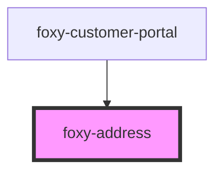

# foxy-address

<!-- Auto Generated Below -->

## Properties

| Property   | Attribute  | Description                                 | Type                                                      | Default                           |
| ---------- | ---------- | ------------------------------------------- | --------------------------------------------------------- | --------------------------------- |
| `endpoint` | `endpoint` | Foxy Customer Portal API endpoint.          | `string`                                                  | `""`                              |
| `locale`   | `locale`   | The language to display element content in. | `any`                                                     | `i18n.defaults.locale.call(this)` |
| `type`     | `type`     | The type of address to display.             | `"default_billing_address" \| "default_shipping_address"` | `"default_billing_address"`       |

## Events

| Event    | Description                                                                                         | Type                                                                                                                                                                                                                                                                                                                                                                                                                                                                                                                                                                                                                                        |
| -------- | --------------------------------------------------------------------------------------------------- | ------------------------------------------------------------------------------------------------------------------------------------------------------------------------------------------------------------------------------------------------------------------------------------------------------------------------------------------------------------------------------------------------------------------------------------------------------------------------------------------------------------------------------------------------------------------------------------------------------------------------------------------- |
| `ready`  | Fired when component becomes ready to be interacted with.                                           | `CustomEvent<void>`                                                                                                                                                                                                                                                                                                                                                                                                                                                                                                                                                                                                                         |
| `update` | Emitted after the component makes changes to the state, containing the changed data in its payload. | `CustomEvent<{ date_created: string; date_modified: string; } & { id: number; last_login_date: string; first_name: string; last_name: string; email: string; tax_id: string; is_anonymous: boolean; } & { _embedded: Record<"fx:subscriptions", Subscription[]>; } & { _embedded: Record<"fx:transactions", Transaction[]>; } & { _embedded: Record<"fx:default_billing_address", Address>; } & { _embedded: Record<"fx:default_shipping_address", Address>; } & { _embedded: Record<"fx:default_payment_method", PaymentMethod>; } & Record<"_links", Record<"fx:checkout", Link>> & { _embedded?: { "fx:attributes"?: Attribute[]; }; }>` |

## Methods

### `getRemoteState() => Promise<GetResponse<GetRequest>>`

Resolves with a customer object containing address
of the default or specified `HTMLFoxyAddressElement.type`.

#### Returns

Type: `Promise<GetResponse<GetRequest>>`

### `getState(forceReload?: boolean) => Promise<any>`

Resolves with a customer object containing address
of the default or specified `HTMLFoxyAddressElement.type`.

#### Returns

Type: `Promise<any>`

### `reset() => Promise<void>`

Clears address form values and resets the component state.

#### Returns

Type: `Promise<void>`

### `setState(value: Partial<GetResponse<{ zoom: Record<"default_billing_address" | "default_shipping_address" | "subscriptions" | "transactions" | "default_payment_method", true>; sso: true; }>>) => Promise<void>`

Sets customer object.

#### Returns

Type: `Promise<void>`

### `submit() => Promise<void>`

Submits the address form, saving changes in the cloud.

#### Returns

Type: `Promise<void>`

## Dependencies

### Used by

 - [foxy-customer-portal](../customer-portal)

### Graph

----------------------------------------------

*Built with [StencilJS](https://stenciljs.com/)*
