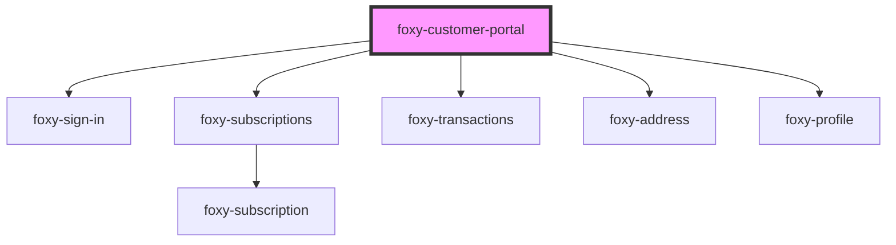

# foxy-customer-portal

<!-- Auto Generated Below -->

## Properties

| Property   | Attribute  | Description                                        | Type      | Default                           |
| ---------- | ---------- | -------------------------------------------------- | --------- | --------------------------------- |
| `endpoint` | `endpoint` | Foxy Customer Portal API endpoint.                 | `string`  | `""`                              |
| `locale`   | `locale`   | The language to display element content in.        | `any`     | `i18n.defaults.locale.call(this)` |
| `router`   | `router`   | Enables hash-based routing.                        | `boolean` | `false`                           |
| `scope`    | `scope`    | Prefix for routes and other top-level identifiers. | `string`  | `"foxy-customer-portal"`          |

## Events

| Event     | Description                                                 | Type                                                                                                                                                                                                                                                                                                                                                                                                                                                                                                                                                                                                                                        |
| --------- | ----------------------------------------------------------- | ------------------------------------------------------------------------------------------------------------------------------------------------------------------------------------------------------------------------------------------------------------------------------------------------------------------------------------------------------------------------------------------------------------------------------------------------------------------------------------------------------------------------------------------------------------------------------------------------------------------------------------------- |
| `ready`   | Fired when component becomes ready to be interacted with.   | `CustomEvent<void>`                                                                                                                                                                                                                                                                                                                                                                                                                                                                                                                                                                                                                         |
| `signin`  | Fired after the user signs in.                              | `CustomEvent<void>`                                                                                                                                                                                                                                                                                                                                                                                                                                                                                                                                                                                                                         |
| `signout` | Fired after the user signs out.                             | `CustomEvent<void>`                                                                                                                                                                                                                                                                                                                                                                                                                                                                                                                                                                                                                         |
| `update`  | Fired after each update of the customer object (the state). | `CustomEvent<{ date_created: string; date_modified: string; } & { id: number; last_login_date: string; first_name: string; last_name: string; email: string; tax_id: string; is_anonymous: boolean; } & { _embedded: Record<"fx:subscriptions", Subscription[]>; } & { _embedded: Record<"fx:transactions", Transaction[]>; } & { _embedded: Record<"fx:default_billing_address", Address>; } & { _embedded: Record<"fx:default_shipping_address", Address>; } & { _embedded: Record<"fx:default_payment_method", PaymentMethod>; } & Record<"_links", Record<"fx:checkout", Link>> & { _embedded?: { "fx:attributes"?: Attribute[]; }; }>` |

## Methods

### `getRemoteState() => Promise<import("/Users/janebentley/Documents/workspace/foxy-customer-portal/src/api/index").GetResponse<{ zoom: Record<"default_billing_address" | "default_shipping_address" | "subscriptions" | "transactions" | "default_payment_method", true>; sso: true; }>>`

Resolves with a customer object (the state).

#### Returns

Type: `Promise<GetResponse<{ zoom: Record<"default_billing_address" | "default_shipping_address" | "subscriptions" | "transactions" | "default_payment_method", true>; sso: true; }>>`

### `getState(forceReload?: boolean) => Promise<any>`

Resolves with a customer object (the state).

#### Returns

Type: `Promise<any>`

### `setState(value: Partial<import("/Users/janebentley/Documents/workspace/foxy-customer-portal/src/api/index").GetResponse<{ zoom: Record<"default_billing_address" | "default_shipping_address" | "subscriptions" | "transactions" | "default_payment_method", true>; sso: true; }>>) => Promise<void>`

Updates the customer object, or the state.

#### Returns

Type: `Promise<void>`

## Dependencies

### Depends on

- [foxy-sign-in](../sign-in)
- [foxy-subscriptions](../subscriptions)
- [foxy-transactions](../transactions)
- [foxy-address](../address)
- [foxy-profile](../profile)

### Graph

----------------------------------------------

*Built with [StencilJS](https://stenciljs.com/)*
