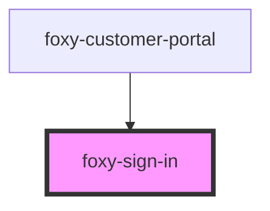

# foxy-sign-in

<!-- Auto Generated Below -->

## Properties

| Property   | Attribute  | Description                                 | Type     | Default                           |
| ---------- | ---------- | ------------------------------------------- | -------- | --------------------------------- |
| `endpoint` | `endpoint` | Foxy Customer Portal API endpoint.          | `string` | `""`                              |
| `locale`   | `locale`   | The language to display element content in. | `any`    | `i18n.defaults.locale.call(this)` |

## Events

| Event    | Description                                                 | Type                |
| -------- | ----------------------------------------------------------- | ------------------- |
| `ready`  | Fired when component becomes ready to be interacted with.   | `CustomEvent<void>` |
| `signin` | Emitted after the user signs in and the auth cookie is set. | `CustomEvent<void>` |

## Dependencies

### Used by

 - [foxy-customer-portal](../customer-portal)

### Graph

----------------------------------------------

*Built with [StencilJS](https://stenciljs.com/)*
