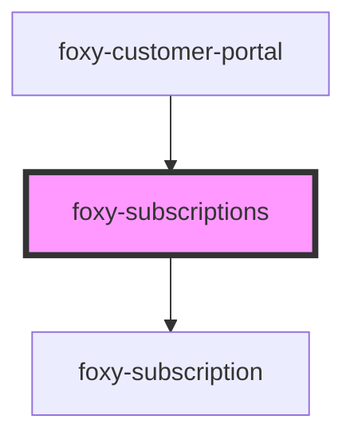

# foxy-subscriptions

## Upgrade from 1.0.0-beta.3 to 1.0.0-beta-4

Since `cols` property is no longer supported and the component uses `foxy-subscription` internally since `1.0.0-beta.4`, you may need to make some changes to your code depending on how customized your setup is:

1. Remove the `cols` attribute;
2. Remove all additional table headers (elements with slot names like `header-${columnIndex}`);
3. Change your slot attribute values from `row-${rowIndex}-col-${columnIndex}` to just `${rowIndex}`;
4. Use `foxy-subscription` element with the appropriate `link` property value to customize individual subscriptions.

### Before

```html
<foxy-subscriptions cols="5">
  <span slot="header-4">Additional actions</span>

  <button
    v-for="(subscription, index) in customer._embedded['fx:subscriptions']"
    :slot="'row-' + index + '-col-4'"
    :key="index"
  >
    Do something
  </button>
</foxy-subscriptions>
```

### After

```html
<foxy-subscriptions>
  <foxy-subscription
    v-for="(subscription, index) in customer._embedded['fx:subscriptions']"
    :link="subscription._links.self.href"
    :slot="index"
    :key="index"
  >
    <button slot="actions">Do something</button>
  </foxy-subscription>
</foxy-subscriptions>
```

<!-- Auto Generated Below -->


## Properties

| Property   | Attribute  | Description                                 | Type     | Default                           |
| ---------- | ---------- | ------------------------------------------- | -------- | --------------------------------- |
| `endpoint` | `endpoint` | Foxy Customer Portal API endpoint.          | `string` | `""`                              |
| `locale`   | `locale`   | The language to display element content in. | `any`    | `i18n.defaults.locale.call(this)` |


## Events

| Event    | Description                                                                                         | Type                                                                                                                                                                                                                                                                                                                                                                                                                                                                                                                                                                                                                                        |
| -------- | --------------------------------------------------------------------------------------------------- | ------------------------------------------------------------------------------------------------------------------------------------------------------------------------------------------------------------------------------------------------------------------------------------------------------------------------------------------------------------------------------------------------------------------------------------------------------------------------------------------------------------------------------------------------------------------------------------------------------------------------------------------- |
| `ready`  | Fired when component becomes ready to be interacted with.                                           | `CustomEvent<void>`                                                                                                                                                                                                                                                                                                                                                                                                                                                                                                                                                                                                                         |
| `update` | Emitted after the component makes changes to the state, containing the changed data in its payload. | `CustomEvent<{ date_created: string; date_modified: string; } & { id: number; last_login_date: string; first_name: string; last_name: string; email: string; tax_id: string; is_anonymous: boolean; } & { _embedded: Record<"fx:subscriptions", Subscription[]>; } & { _embedded: Record<"fx:transactions", Transaction[]>; } & { _embedded: Record<"fx:default_billing_address", Address>; } & { _embedded: Record<"fx:default_shipping_address", Address>; } & { _embedded: Record<"fx:default_payment_method", PaymentMethod>; } & Record<"_links", Record<"fx:checkout", Link>> & { _embedded?: { "fx:attributes"?: Attribute[]; }; }>` |


## Methods

### `getRemoteState() => Promise<GetResponse<GetRequest>>`

Resolves with a customer object that's guaranteed to contain
the `_embedded["fx:subscriptions"]` array with downloaded subscriptions.

#### Returns

Type: `Promise<GetResponse<GetRequest>>`


### `getState(forceReload?: boolean) => Promise<any>`

Resolves with a customer object that's guaranteed to contain
the `_embedded["fx:subscriptions"]` array with downloaded subscriptions.

#### Returns

Type: `Promise<any>`


### `setState(value: Partial<GetResponse<{ zoom: Record<"default_billing_address" | "default_shipping_address" | "subscriptions" | "transactions" | "default_payment_method", true>; sso: true; }>>) => Promise<void>`

Sets customer object.

#### Returns

Type: `Promise<void>`


## Dependencies

### Used by

 - [foxy-customer-portal](../customer-portal)

### Depends on

- [foxy-subscription](../subscription)

### Graph


----------------------------------------------

*Built with [StencilJS](https://stenciljs.com/)*
